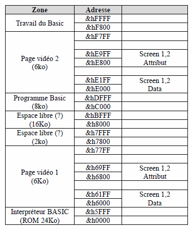

# Hack de la ROM du Sanyo PHC-25

___
## Introduction

Analyse de la ROM pour améliorer le PHC-25.\
Le jeu de caractères sur la version PAL est médiocre.\
SANYO c'est contenté de faire un RAZ (mise à 00) de tout les caractères Kanji.\
le résultat c'est une grosse limitation pour les programmes en comparaison des machines de la même pèriode.
Par exemple le ZX81 qui fait mieux (mais il est UK.

### Analyse de la ROM Basic

Recherche des adresses mémoire pour le jeu de caractères.\
Il est logé en fin de ROM (&h4FEC à &h5BEB).

Création de nouveaux caractères sur la plage étendue qui a été RAZ par SANYO.\
Plage &h5634 à &h5BEB.

Les caractères ASCII bas (00 à 31) sont sur la plage &h4FEC à &h516B.\
Il y a bien les caractères semi-graphiques de base.\
Très mauvaise idée de mettre des semi-graphique ici.

### Inspiration pour nouveaux caractères

[Jeu de caractères AMSTRAD](https://asmtradcpc.zilog.fr/docs/Table_des_caracteres_ASCII.php)\
et ZX81.


### Les Tests

les Tests sur émulateur 
 - v1.04 PAL de G. Fetis = OK
 - v1.X PAL de ... 
 - MAME : Non fait


Pas rencontré de bug ou d'effet de bord.\
Test à faire sur une vraie machine avec cette ROM modifiée.\
Je n'en ai pas.


___
## Plage Mémoire du PHC-25

En fonction des données trouvées qui sont faites aussi par d'autres.

Plages mémoire, etc.\
Le markdown ne permet pas des tableaux complexes.\
C'est donc une image.


### Rappel des zones mémoire écran 1 et 2

L'écran 1 et l'écran principal.

Mode screen 1 et screen 2 (text)

De &h6000 à &h61FF pour l'affichage.\
De &h6800 à &h69FF pour les attributs.

2 x 512 octets.\
Englobé dans la zone des 6ko.

Mode Screen 3 et screen 4 (graphic)

De &h6000 à &h77FF pour l’écran 1.\
De &hE000 à &hF700 pour l’écran 2.\
Chaque plage d’adresse occupe 6Ko.

### Plage mémoire connue à date



Il y a encore des zones à identifier dessus.

### Adresse mémoire des instructions du basic

&H02C9 à &H0491 : Mots clés du BASIC en clair.

Table des entrées du Basic par mot clé.\
Ces valeurs peuvent être incertaines.\
Pour certaines, si OK alors testée et validée.


| Comment | Adresse | Comment  |
|---------|---------|----------|
| ABS     |  |
| AND     |  |
| ASC     |  |
| CHR$    |  |
| CLEAR   | &H1981 |
| CLOAD   | &H40F2 |
| CLOAD?  |
| CLS     | &H3F70 | OK |
| COLOR   | &H3CF6 |
| CONSOLE | &H3EA9 |
| CONT    | &H193F |
| COS     | |
| CSAVE   | &H4442 |
| CSRLIN  | |
| CTOFF   | &H4555 |
| CTON    | &H454E |
| DATA    | &H2553 |
| DEF     | &H236E |
| DIM     | &H213F |
| ELSE    | &H05E1 |
| END     | &H1907 |
| EXEC    | &H1070 |
| EXP     |  |
| FN      | &H2E49 |
| FOR     | &H07BF |
| FRE     |  |
| GOSUB   | &H08E0 |
| GOTO    | &H08F5 |
| IF      | &H0979 |
| INKEY$  | &H2483  |
| INP     |  |
| INPUT   | &H0A1F | OK |
| INPUT#  |  |
| INT     |  |
| KEY     | &H0F3A |
| LCOPY   | &H0FC6 |
| LEFT$   |  |
| LEN     |  |
| LET     | &H24F9 |
| LINE    | &H3921 |
| LIST    | &H25DB |
| LLIST   | &H25D6 |
| LOCATE  | &H3E73 |
| LOG     |  |
| LPOS    |  |
| LPRINT  | &H266C |
| MID$    |  |
| NEW     | &H1866 |
| NEXT    | &H1A4C |
| NOT     |  |
| ON      | &H095C |
| OR      |  |
| OUT     | &H24E2 |
| PAINT   | &H37A2 |
| PEEK    |  |
| PLAY    | &H4907 |
| POINT   |  |
| POKE    | &H24EE |
| POS     |  |
| PRESET  | &H3B56 |
| PRINT   | &H2673 |
| PRINT#  |  |
| PSET    | &H3B36 |
| READ    | &H0A66 |
| REM     | &H254D |
| RESTORE | &H18D1 |
| RETURN  | &H0936 |
| RIGHT$  |  |
| RND     |  |
| RUN     | &H08C2 |
| SCREEN  | &H3F1B |
| SCRIN   |  |
| SGN     |  |
| SIN     |  |
| SLOAD   | &H4086 |
| SOUND   | &H4679 |
| SPC     | &H1AA6 |
| SQR     |  |
| SSAVE   | &H4344 |
| STEP    |  |
| STICK   |  |
| STOP    | &H18FD |
| STRIG   |  |
| STR$    |  |
| TAB     | &H2E43 |
| TAN     |  |
| TIME    |  |
| THEN    |  |
| TO      | &H2E35 |
| USR     |  |
| VAL     |  |

Table par les adresses connues ordre croissant.

| Adresse  | Comment  | Comment  |
|----------|----------|----------|
| &H05E1   | ELSE     |          |
| &H07BF   | FOR      |          |
| &H08C2   | RUN      |          |
| &H08E0   | GOSUB    |          |
| &H08F5   | GOTO     |          |
| &H0936   | RETURN   |          |
| &H095C   | ON       |          |
| &H0979   | IF       |          |
| &H0A1F   | INPUT    |          |
| &H0A66   | READ     |          |
| &H0F3A   | KEY      |          |
| &H0FC6   | LCOPY    |          |
| &H1070   | EXEC     |          |
| &H1866   | NEW      |          |
| &H18D1   | RESTORE  |          |
| &H18FD   | STOP     |          |
| &H1907   | END      |          |
| &H193F   | CONT     |          |
| &H1981   | CLEAR    |          |
| &H1A4C   | NEXT     |          |
| &H1AA6   | SPC      |          |
| &H213F   | DIM      |          |
| &H236E   | DEF      |          |
| &H2483   | INKEY$   |          |
| &H24E2   | OUT      |          |
| &H24EE   | POKE     |          |
| &H24F9   | LET      |          |
| &H254D   | REM      |          |
| &H2553   | DATA     |          |
| &H25D6   | LLIST    |          |
| &H25DB   | LIST     |          |
| &H266C   | LPRINT   |          |
| &H2673   | PRINT    |          |
| &H2E35   | TO       |          |
| &H2E43   | TAB      |          |
| &H2E49   | FN       |          |
| &H3921   | LINE     |          |
| &H37A2   | PAINT    |          |
| &H3B36   | PSET     |          |
| &H3B56   | PRESET   |          |
| &H3CF6   | COLOR    |          |
| &H3E73   | LOCATE   |          |
| &H3EA9   | CONSOLE  |          |
| &H3F1B   | SCREEN   |          |
| &H3F70   | CLS      |          |
| &H4086   | SLOAD    |          |
| &H40F2   | CLOAD    |          |
| &H4344   | SSAVE    |          |
| &H4442   | CSAVE    |          |
| &H454E   | CTON     |          |
| &H4555   | CTOFF    |          |
| &H4679   | SOUND    |          |
| &H4907   | PLAY     |          |


___
## Analyse de la ROM BASIC

En &h0000:

```asm
c3 af 0b  CALL &h0BAF
```
Jump, vars le boot ?

### Message de bienvenu

Après le choix 1 ou 2 du boot.

| Deb. | Fin  | Comment  |
|------|------|----------|
| 005B | 0074 | Message après choix |
| 0130 | 0136 | Ready |


### Messages d'erreurs

Début en &H0137 ou &H0138 si on prend le séparateur &H00.

| Deb. | Fin  | Comment  |
|------|------|----------|
| 0138 |      | Break |
|      |      | Next w/o for |
|      |      | Syntax error |
|      |      | Return w/o gosub |
|      |      | Not enough data |
|      |      | Illegal function call |
|      |      | Over flow |
|      |      | Out of memory |
|      |      | Undefined line number |
|      |      | Bad subscript |
|      |      | Duplicate definition |
|      |      | Divided by zero |
|      |      | Illegal direct call |
|      |      | Type mismatched |
|      |      | Out of string space |
|      |      | Too long string |
|      |      | String too complex |
|      |      | Can't continue |
|      |      | Undefined FN call |
|      |      | Tape read error |
|      | 028B | Missing operand |

Fin en &H028A ou &H028B si on prend en compte ou pas le séparateur &H00.

Puis en fin de ROM on trouve le jeu de caractère.

___
## Tables adresse jeux de caractère

La colonne « Hexa » des tables correspond au 12 octets en hexadécimal.\


### Table ASCII basse

En principe ce sont les caractères de contrôles et non affichable.

Va savoir pourquoi SANYO y a collé des caractères graphique... :-/

Pas encore trouvé de méthode par programme pour afficher le caractère.\
Par exemple, « PRINT CHR$(16) » ne fonctionne pas, à la place il semblerait que l'on enchaîne un LF CR.\
Ce comportement est tout à fait logique.\
« PRINT CHR$(7) » fait bien un bip.


| No | &H | ASCII | Adresse | Touche | Hexa (dump)                         | Commentaire     |
|----|----|-------|---------|--------|-------------------------------------|-----------------|
| 0  | 00 | NUL   | 4FEC    |        | 00 00 00 00 00 00 00 00 00 00 00 00 |                 |
| 1  | 01 | SOH   | 4FF8    | 2      | 00 00 00 00 00 00 00 00 00 00 00 00 |                 |
| 2  | 02 | STX   | 5004    | 3      | 00 00 00 00 00 00 00 00 00 00 00 00 |                 |
| 3  | 03 | ETX   | 5010    | 4      | 00 00 00 00 00 00 00 00 00 00 00 00 |                 |
| 4  | 04 | EOT   | 501C    | 5      | 00 00 00 00 00 00 00 00 00 00 00 00 |                 |
| 5  | 05 | ENQ   | 5028    | 6      | 00 00 00 00 00 00 00 00 00 00 00 00 |                 |
| 6  | 06 | ACK   | 5034    | 7      | 00 00 00 00 00 00 00 00 00 00 00 00 |                 |
| 7  | 07 | BEL   | 5040    | 1      | 00 00 00 00 00 00 00 00 00 00 00 00 | Bip             |
| 8  | 08 | BS    | 504C    | Y      | 00 00 00 00 00 00 00 00 00 00 00 00 |                 |
| 9  | 09 | TAB   | 5058    | \      | 00 00 00 00 00 00 00 00 00 00 00 00 |                 |
| 10 | 0A | LF    | 5064    | H      | 00 00 00 00 00 00 00 00 00 00 00 00 | Line Feed       |
| 11 | 0B | VT    | 5070    | M      | 00 00 00 00 00 00 00 00 00 00 00 00 |                 |
| 12 | 0C | FF    | 507C    | S      | 00 00 00 00 00 00 00 00 00 00 00 00 | (CLS)           |
| 13 | 0D | CR    | 5088    | 8      | 00 00 00 00 00 00 00 00 00 00 00 00 | Carriage Return |
| 14 | 0E | SO    | 5094    | 9      | 00 00 00 00 00 00 00 00 00 00 00 00 |                 |
| 15 | 0F | SI    | 50A0    | 0      | 00 00 00 00 00 00 00 00 00 00 00 00 |                 |
| 16 | 10 | DLE   | 50AC    | P      | 00 00 00 7E A8 28 28 28 48 8E 00 00 | pi              |
| 17 | 11 | DC1   | 50B8    | V      | 18 18 18 18 18 FF FF 00 00 00 00 00 | ┴               |
| 18 | 12 | DC2   | 50C4    | R      | 00 00 00 00 00 FF FF 18 18 18 18 18 | ┬               |
| 19 | 13 | DC3   | 50D0    | G      | 18 18 18 18 18 F8 F8 18 18 18 18 18 | ┤               |
| 20 | 14 | DC4   | 50DC    | D      | 18 18 18 18 18 1F 1F 18 18 18 18 18 | ├               |
| 21 | 15 | NAK   | 50E8    | F      | 18 18 18 18 18 FF FF 18 18 18 18 18 | ┼               |
| 22 | 16 | SYN   | 50F4    | I      | 18 18 18 18 18 18 18 18 18 18 18 18 | │               |
| 23 | 17 | ETB   | 5100    | -      | 00 00 00 00 00 FF FF 00 00 00 00 00 | ─               |
| 24 | 18 | CAN   | 510C    | E      | 00 00 00 00 00 1F 1F 18 18 18 18 18 | ┌               |
| 25 | 19 | EM    | 5118    | T      | 00 00 00 00 00 F8 F8 18 18 18 18 18 | ┐               |
| 26 | 1A | SUB   | 5124    | C      | 18 18 18 18 18 1F 1F 00 00 00 00 00 | └               |
| 27 | 1B | ESC   | 5130    | B      | 18 18 18 18 18 F8 F8 00 00 00 00 00 | ┘               |
| 28 | 1C | FS    | 513C    | X      | 00 00 82 44 28 10 28 44 82 00 00 00 | X               |
| 29 | 1D | GS    | 5148    | .      | 00 00 00 00 00 00 00 00 00 00 00 00 |                 |
| 30 | 1E | RS    | 5154    | L      | 00 00 00 00 00 00 00 00 00 00 00 00 |                 |
| 31 | 1F | US    | 5160    | ,      | 00 00 00 00 00 00 00 00 00 00 00 00 |                 |

L'accès à ces caractères se fait au moyen de la touche GRAPH puis d'une autre touche du clavier.
Ces caractères faisant partie des CONTROL, il y a un problème pour imprimer ceux-ci.\
Par exemple un programme où ils sont insérer, si on l'imprime, le caractère de contrôle est passé à l'imprimante.\
C'est ce qui se passe avec les émulateurs.\

Une des raisons suplémentaire de reporter ces caractères vers la zone étendue.

La touche GRAPH doit être utilisée seule, sinon rien ne se passe.\
Pas trouvé la touche pour le 00, probable que ce soit la touche vierge, qui n'est pas émulée.

Ce n'est pas un espace, car cela provoque l'erreur « Syntax error ».


___
### Table ASCII standard

RAS, sinon que les caractères on une police fine.

| No  | &H | ASCII | Adresse | Hexa (dump)                         | Commentaire |
|-----|----|-------|---------|-------------------------------------|-------------|
| 32  | 20 | SPC   | 516C    | 00 00 00 00 00 00 00 00 00 00 00 00 |             |
| 33  | 21 | !     | 5178    | 00 00 10 10 10 10 10 00 00 10 00 00 |             |
| 34  | 22 | "     | 5184    | 00 28 28 28 00 00 00 00 00 00 00 00 |             |
| 35  | 23 | \#    | 5190    | 00 44 44 FE 44 44 44 FE 44 44 00 00 |             |
| 36  | 24 | $     | 519C    | 00 10 7E 90 90 7C 12 12 FC 10 00 00 |             |
| 37  | 25 | %     | 51A8    | 00 E0 A2 E4 08 10 20 4E 8A 0E 00 00 |             |
| 38  | 26 | &     | 51B4    | 00 70 88 88 50 20 50 8A 84 7A 00 00 |             |
| 39  | 27 | '     | 51C0    | 00 30 30 10 20 00 00 00 00 00 00 00 |             |
| 40  | 28 | (     | 51CC    | 00 0C 10 20 20 20 20 20 10 0C 00 00 |             |
| 41  | 29 | )     | 51D8    | 00 60 10 08 08 08 08 08 10 60 00 00 |             |
| 42  | 2A | \*    | 51E4    | 00 00 10 92 54 38 54 92 10 00 00 00 |             |
| 43  | 2B | +     | 51F0    | 00 00 10 10 10 FE 10 10 10 00 00 00 |             |
| 44  | 2C | ,     | 51FC    | 00 00 00 00 00 00 30 30 10 20 00 00 |             |
| 45  | 2D | -     | 5208    | 00 00 00 00 00 FE 00 00 00 00 00 00 |             |
| 46  | 2E | .     | 5214    | 00 00 00 00 00 00 00 00 60 60 00 00 |             |
| 47  | 2F | /     | 5220    | 00 00 02 04 08 10 20 40 80 00 00 00 |             |
| 48  | 30 | 0     | 522C    | 00 3C 42 42 46 5A 62 42 42 3C 00 00 |             |
| 49  | 31 | 1     | 5238    | 00 08 18 28 08 08 08 08 08 3E 00 00 |             |
| 50  | 32 | 2     | 5244    | 00 3C 42 02 02 04 18 20 40 7E 00 00 |             |
| 51  | 33 | 3     | 5250    | 00 7E 02 04 18 04 02 02 42 3C 00 00 |             |
| 52  | 34 | 4     | 525C    | 00 0C 14 24 44 44 44 7E 04 04 00 00 |             |
| 53  | 35 | 5     | 5268    | 00 7E 40 40 7C 02 02 02 42 3C 00 00 |             |
| 54  | 36 | 6     | 5274    | 00 1C 20 40 40 7C 42 42 42 3C 00 00 |             |
| 55  | 37 | 7     | 5280    | 00 7E 42 42 04 08 10 10 10 10 00 00 |             |
| 56  | 38 | 8     | 528C    | 00 3C 42 42 42 3C 42 42 42 3C 00 00 |             |
| 57  | 39 | 9     | 5298    | 00 3C 42 42 42 3E 02 02 04 38 00 00 |             |
| 58  | 3A | :     | 52A4    | 00 00 00 30 30 00 00 30 30 00 00 00 |             |
| 59  | 3B | ;     | 52B0    | 00 00 00 30 30 00 00 30 10 20 00 00 |             |
| 60  | 3C | <     | 52BC    | 00 04 08 10 20 40 20 10 08 04 00 00 |             |
| 61  | 3D | =     | 52C8    | 00 00 00 FE 00 00 FE 00 00 00 00 00 |             |
| 62  | 3E | >     | 52D4    | 00 40 20 10 08 04 08 10 20 40 00 00 |             |
| 63  | 3F | ?     | 52E0    | 00 38 44 44 04 08 10 10 00 10 00 00 |             |
| 64  | 40 | @     | 52EC    | 00 3C 42 02 02 32 4A 4A 4A 3C 00 00 |             |
| 65  | 41 | A     | 52F8    | 00 18 24 42 42 42 7E 42 42 42 00 00 |             |
| 66  | 42 | B     | 5304    | 00 7C 22 22 22 3C 22 22 22 7C 00 00 |             |
| 67  | 43 | C     | 5310    | 00 1C 22 40 40 40 40 40 22 1C 00 00 |             |
| 68  | 44 | D     | 531C    | 00 78 44 42 42 42 42 42 44 78 00 00 |             |
| 69  | 45 | E     | 5328    | 00 7E 40 40 40 7C 40 40 40 7E 00 00 |             |
| 70  | 46 | F     | 5334    | 00 7E 40 40 40 78 40 40 40 40 00 00 |             |
| 71  | 47 | G     | 5340    | 00 3C 42 40 40 4E 42 42 46 3A 00 00 |             |
| 72  | 48 | H     | 534C    | 00 42 42 42 42 7E 42 42 42 42 00 00 |             |
| 73  | 49 | I     | 5358    | 00 38 10 10 10 10 10 10 10 38 00 00 |             |
| 74  | 4A | J     | 5364    | 00 3E 08 08 08 08 08 08 48 30 00 00 |             |
| 75  | 4B | K     | 5370    | 00 42 44 48 50 60 50 48 44 42 00 00 |             |
| 76  | 4C | L     | 537C    | 00 40 40 40 40 40 40 40 40 7E 00 00 |             |
| 77  | 4D | M     | 5388    | 00 82 C6 AA 92 92 82 82 82 82 00 00 |             |
| 78  | 4E | N     | 5394    | 00 82 82 C2 A2 92 8A 86 82 82 00 00 |             |
| 79  | 4F | O     | 53A0    | 00 3C 42 42 42 42 42 42 42 3C 00 00 |             |
| 80  | 50 | P     | 53AC    | 00 7C 42 42 42 7C 40 40 40 40 00 00 |             |
| 81  | 51 | Q     | 53B8    | 00 3C 42 42 42 42 42 4A 44 3A 00 00 |             |
| 82  | 52 | R     | 53C4    | 00 7C 42 42 42 7C 50 48 44 42 00 00 |             |
| 83  | 53 | S     | 53D0    | 00 3C 42 40 40 3C 02 02 42 3C 00 00 |             |
| 84  | 54 | T     | 53DC    | 00 FE 10 10 10 10 10 10 10 10 00 00 |             |
| 85  | 55 | U     | 53E8    | 00 42 42 42 42 42 42 42 42 3C 00 00 |             |
| 86  | 56 | V     | 53F4    | 00 82 82 82 82 44 44 28 28 10 00 00 |             |
| 87  | 57 | W     | 5400    | 00 82 82 82 82 92 92 92 AA 44 00 00 |             |
| 88  | 58 | X     | 540C    | 00 82 82 44 28 10 28 44 82 82 00 00 |             |
| 89  | 59 | Y     | 5418    | 00 82 82 44 28 10 10 10 10 10 00 00 |             |
| 90  | 5A | Z     | 5424    | 00 FE 02 04 08 10 20 40 80 FE 00 00 |             |
| 91  | 5B | \[    | 5430    | 00 38 20 20 20 20 20 20 20 38 00 00 |             |
| 92  | 5C | \     | 543C    | 00 40 40 20 10 08 04 02 02 00 00 00 |             |
| 93  | 5D | ]     | 5448    | 00 38 08 08 08 08 08 08 08 38 00 00 |             |
| 94  | 5E | ^     | 5454    | 00 10 28 44 82 00 00 00 00 00 00 00 |             |
| 95  | 5F | _     | 5460    | 00 00 00 00 00 00 00 00 00 FE 00 00 |             |
| 96  | 60 | \`    | 546C    | 00 30 30 20 10 00 00 00 00 00 00 00 |             |
| 97  | 61 | a     | 5478    | 00 00 00 00 38 04 3C 44 44 3A 00 00 |             |
| 98  | 62 | b     | 5484    | 00 40 40 40 78 44 44 44 44 78 00 00 |             |
| 99  | 63 | c     | 5490    | 00 00 00 00 38 44 40 40 44 38 00 00 |             |
| 100 | 64 | d     | 549C    | 00 04 04 04 3C 44 44 44 44 3C 00 00 |             |
| 101 | 65 | e     | 54A8    | 00 00 00 00 38 44 7C 40 40 3C 00 00 |             |
| 102 | 66 | f     | 54B4    | 00 0C 10 10 7E 10 10 10 10 10 00 00 |             |
| 103 | 67 | g     | 54C0    | 00 00 00 00 3C 44 44 44 3C 04 04 38 |             |
| 104 | 68 | h     | 54CC    | 00 40 40 40 58 64 44 44 44 44 00 00 |             |
| 105 | 69 | i     | 54D8    | 00 00 10 00 30 10 10 10 10 38 00 00 |             |
| 106 | 6A | j     | 54E4    | 00 00 08 00 18 08 08 08 08 08 08 70 |             |
| 107 | 6B | k     | 54F0    | 00 40 40 40 44 48 50 68 44 42 00 00 |             |
| 108 | 6C | l     | 54FC    | 00 10 10 10 10 10 10 10 10 08 00 00 |             |
| 109 | 6D | m     | 5508    | 00 00 00 00 EC 92 92 92 92 92 00 00 |             |
| 110 | 6E | n     | 5514    | 00 00 00 00 3C 22 22 22 22 22 00 00 |             |
| 111 | 6F | o     | 5520    | 00 00 00 00 38 44 44 44 44 38 00 00 |             |
| 112 | 70 | p     | 552C    | 00 00 00 00 78 44 44 44 78 40 40 40 |             |
| 113 | 71 | q     | 5538    | 00 00 00 00 3C 44 44 44 3C 04 04 04 |             |
| 114 | 72 | r     | 5544    | 00 00 00 40 5C 60 40 40 40 40 00 00 |             |
| 115 | 73 | s     | 5550    | 00 00 00 38 44 40 38 04 44 38 00 00 |             |
| 116 | 74 | t     | 555C    | 00 00 00 10 7C 10 10 10 10 0C 00 00 |             |
| 117 | 75 | u     | 5568    | 00 00 00 00 44 44 44 44 44 3A 00 00 |             |
| 118 | 76 | v     | 5574    | 00 00 00 00 44 44 44 28 28 10 00 00 |             |
| 119 | 77 | w     | 5580    | 00 00 00 00 82 92 92 92 AA 44 00 00 |             |
| 120 | 78 | x     | 558C    | 00 00 00 00 42 24 18 18 24 42 00 00 |             |
| 121 | 79 | y     | 5598    | 00 00 00 00 44 44 44 44 3C 04 04 38 |             |
| 122 | 7A | z     | 55A4    | 00 00 00 00 7C 08 10 10 20 7C 00 00 |             |
| 123 | 7B | {     | 55B0    | 00 0C 10 10 10 20 10 10 10 0C 00 00 |             |
| 124 | 7C | \|    | 55BC    | 00 10 10 10 00 00 00 10 10 10 00 00 |             |
| 125 | 7D | }     | 55C8    | 00 30 08 08 08 04 08 08 08 30 00 00 |             |
| 126 | 7E | ~     | 55D4    | 00 60 92 0C 00 00 00 00 00 00 00 00 |             |
| 127 | 7F |       | 55E0    | 00 00 00 00 00 00 00 00 00 00 00 00 |             |

Pour le 127, il faudrait voir la ROM Japonnaise. Quitte à le recoder.\
Mais il y a un risque de rétrocompatibilité avec la ROM PAL originale.

___
### Table ASCII étendue

Codage de 121 caractères suplémentaires. Les 6 premiers déjà pris (128 à 133).\
Inspiré de l'AMSTRAD et du ZX81. Plus création pixel art.\
Design fin comme ceux standard.

Les char affichés sont ceux de la normes UTF8. Mais ça donne une idée.

Il y a une legere modification de 1 pixel sur les caractères tableau par rapport à ceux définis.


| ASCII | &H | Char | Adresse  | Hexa (dump)                         | Comment                   |
|-------|----|------|----------|-------------------------------------|---------------------------|
| 128   | 80 | ♠    | 55EC     | 00 10 38 7C FE FE FE 10 38 7C 00 00 | Pique                     |
| 129   | 81 | ♥    | 55F8     | 00 00 6C FE FE FE FE 7C 38 10 00 00 | Coeur                     |
| 130   | 82 | ♣    | 5604     | 00 38 38 FE FE FE D6 10 38 7C 00 00 | Trèfle                    |
| 131   | 83 | ♦    | 5610     | 00 10 38 38 7C FE 7C 38 38 10 00 00 | Carreau                   |
| 132   | 84 | ○    | 561C     | 00 00 38 44 82 82 82 44 38 00 00 00 | Rond vide                 |
| 133   | 85 | ●    | 5628     | 00 00 38 7C FE FE FE 7C 38 00 00 00 | Rond plein                |
| 134   | 86 |      | 5634     | 00 00 7E 42 42 42 42 42 42 7E 00 00 | carré                     |
| 135   | 87 |      | 5640     | 00 00 7E 7E 7E 7E 7E 7E 7E 7E 00 00 | carré plein               |
| 136   | 88 |      | 564C     | 00 00 82 44 28 10 28 44 82 00 00 00 | X                         |
| 137   | 89 |      | 5658     | 00 00 00 7C A8 28 28 28 48 8E 00 00 | Signe PI                  |
| 138   | 8A |      | 5664     | 00 00 00 10 00 FE 00 10 00 00 00 00 | signe divisé              |
| 139   | 8B |      | 5670     | 00 00 10 00 10 10 08 04 44 44 38 00 | ? à l'envers              |
| 140   | 8C |      | 567C     | 00 00 10 00 00 10 10 10 10 10 10 00 | ! à l'envers              |
| 141   | 8D |      | 5688     | 00 10 28 44 00 00 00 00 00 00 00 00 | circonflex ^              |
| 142   | 8E |      | 5694     | 00 10 10 20 00 00 00 00 00 00 00 00 | ' aigüe                   |
| 143   | 8F |      | 56A0     | 00 10 10 08 00 00 00 00 00 00 00 00 | ' grave                   |
| 144   | 90 |      | 56AC     | 00 00 38 44 38 00 00 00 00 00 00 00 | accent o                  |
| 145   | 91 |      | 56B8     | 00 28 00 00 00 00 00 00 00 00 00 00 | tréma                     | 
| 146   | 92 |      | 56C4     | 00 00 40 C0 44 4C 54 1E 04 00 00 00 | 1/4                       |
| 147   | 93 |      | 56D0     | 00 00 40 C0 4C 52 44 08 1E 00 00 00 | 1/2                       |
| 148   | 94 |      | 56DC     | 00 00 E0 10 62 16 EA 0F 02 00 00 00 | 1/3                       |
| 149   | 95 |      | 56E8     | 00 00 00 00 00 18 18 00 00 00 00 00 | - tableau .               |
| 150   | 96 | ╵    | 56F4     | 18 18 18 18 18 18 18 00 00 00 00 00 | - tableau H               |
| 151   | 97 | ╶    | 5700     | 00 00 00 00 00 1F 1F 00 00 00 00 00 | - tableau D               |
| 152   | 98 | ╷    | 570C     | 00 00 00 00 00 18 18 18 18 18 18 18 | - tableau B               |
| 153   | 99 | ╴    | 5718     | 00 00 00 00 00 F8 F8 00 00 00 00 00 | - tableau G               |
| 154   | 9A | └    | 5724     | 18 18 18 18 18 1F 0F 00 00 00 00 00 | - tableau HD              |
| 155   | 9B | ┌    | 5730     | 00 00 00 00 00 0F 1F 18 18 18 18 18 | - tableau DB              |
| 156   | 9C | ┘    | 573C     | 18 18 18 18 18 F8 F0 00 00 00 00 00 | - tableau HG              |
| 157   | 9D | ┐    | 5748     | 00 00 00 00 00 F0 F8 18 18 18 18 18 | - tableau GB              |
| 158   | 9E | │    | 5754     | 18 18 18 18 18 18 18 18 18 18 18 18 | - tableau HB              |
| 159   | 9F | ─    | 5760     | 00 00 00 00 00 FF FF 00 00 00 00 00 | - tableau DG              |
| 160   | A0 | ┴    | 576C     | 18 18 18 18 18 FF FF 00 00 00 00 00 | - tableau HDG             |
| 161   | A1 | ├    | 5778     | 18 18 18 18 18 1F 1F 18 18 18 18 18 | - tableau HDB             |
| 162   | A2 | ┬    | 5784     | 00 00 00 00 00 FF FF 18 18 18 18 18 | - tableau GBD             |
| 163   | A3 | ┤    | 5790     | 18 18 18 18 18 F8 F8 18 18 18 18 18 | - tableau HGB             |
| 164   | A4 | ┼    | 579C     | 18 18 18 18 18 FF FF 18 18 18 18 18 | - tableau croix HBGD      |
| 165   | A5 | ▔    | 57A8     | FF FF 00 00 00 00 00 00 00 00 00 00 | barre H                   |
| 166   | A6 | ▏    | 57B4     | 03 03 03 03 03 03 03 03 03 03 03 03 | barre G                   |
| 167   | A7 | ▁    | 57C0     | 00 00 00 00 00 00 00 00 00 00 FF FF | barre B                   |
| 168   | A8 | ▕    | 57CC     | C0 C0 C0 C0 C0 C0 C0 C0 C0 C0 C0 C0 | barre D                   |
| 169   | A9 | ▀    | 57D8     | FF FF FF FF FF FF 00 00 00 00 00 00 | - bloc H                  |
| 170   | AA | ▐    | 57E4     | 0F 0F 0F 0F 0F 0F 0F 0F 0F 0F 0F 0F | - bloc D                  |
| 171   | AB | ▄    | 57F0     | 00 00 00 00 00 00 FF FF FF FF FF FF | - bloc B                  |
| 172   | AC | ▌    | 57FC     | F0 F0 F0 F0 F0 F0 F0 F0 F0 F0 F0 F0 | - Bloc G                  |
| 173   | AD | ▝    | 5808     | 0F 0F 0F 0F 0F 0F 00 00 00 00 00 00 | - bloc HD                 |
| 174   | AE | ▘    | 5814     | F0 F0 F0 F0 F0 F0 00 00 00 00 00 00 | - bloc HG                 |
| 175   | AF | ▗    | 5820     | 00 00 00 00 00 00 0F 0F 0F 0F 0F 0F | - bloc BD                 |
| 176   | B0 | ▖    | 582C     | 00 00 00 00 00 00 F0 F0 F0 F0 F0 F0 | - bloc BG                 |
| 177   | B1 | ▞    | 5838     | 0F 0F 0F 0F 0F 0F F0 F0 F0 F0 F0 F0 | - bloc                    |
| 178   | B2 | ▚    | 5844     | F0 F0 F0 F0 F0 F0 0F 0F 0F 0F 0F 0F | - bloc                    |
| 179   | B3 | ▛    | 5850     | FF FF FF FF FF FF F0 F0 F0 F0 F0 F0 | - bloc                    |
| 180   | B4 | ▜    | 585C     | FF FF FF FF FF FF 0F 0F 0F 0F 0F 0F | - bloc                    |
| 181   | B5 | ▙    | 5868     | F0 F0 F0 F0 F0 F0 FF FF FF FF FF FF | - bloc                    |
| 182   | B6 | ▜    | 5874     | FF FF FF FF FF FF 0F 0F 0F 0F 0F 0F | - bloc                    |
| 183   | B7 | ▊    | 5880     | FF FF FF FF FF FF FF FF FF FF FF FF | - Bloc plein              |
| 184   | B8 |      | 588C     | 00 00 00 00 00 00 00 00 0F 0F 0F 0F | 4x4                       |
| 185   | B9 |      | 5898     | 00 00 00 00 00 00 00 00 F0 F0 F0 F0 | 4x4                       |
| 186   | BA |      | 58A4     | 0F 0F 0F 0F 00 00 00 00 00 00 00 00 | 4x4                       |
| 187   | BB |      | 58B0     | F0 F0 F0 F0 00 00 00 00 00 00 00 00 | 4x4                       |
| 188   | BC |      | 58BC     | 00 00 00 00 0F 0F 0F 0F 00 00 00 00 | 4x4                       |
| 189   | BD |      | 58C8     | 00 00 00 00 F0 F0 F0 F0 00 00 00 00 | 4x4                       |
| 190   | BE |      | 58D4     | 03 03 03 06 0E 1C 38 70 60 C0 C0 C0 | barre /                   |
| 191   | BF |      | 58E0     | C0 C0 C0 60 70 38 1C 0E 06 03 03 03 | barre \                   |
| 192   | C0 |      | 58EC     | CC CC 33 33 CC CC 33 33 CC CC 33 33 | damier 2x2                |
| 193   | C1 |      | 58F8     | CC 33 CC 33 CC 33 CC 33 CC 33 CC 33 | damier 1x2                |
| 194   | C2 |      | 5904     | AA 55 AA 55 AA 55 AA 55 AA 55 AA 55 | damier 1x1                |
| 195   | C3 |      | 5910     | A0 50 A0 50 A0 50 00 00 00 00 00 00 | damier 1x1 1              |
| 196   | C4 |      | 591C     | 0A 05 0A 05 0A 05 00 00 00 00 00 00 | damier 1x1 2              |
| 197   | C5 |      | 5928     | 00 00 00 00 00 00 0A 05 0A 05 0A 05 | damier 1x1 3              |
| 198   | C6 |      | 5934     | 00 00 00 00 00 00 A0 50 A0 50 A0 50 | damier 1x1 4              |
| 199   | C7 |      | 5940     | AA 55 AA 55 AA 55 00 00 00 00 00 00 | damier 1x1 H              |
| 200   | C8 |      | 594C     | 0A 05 0A 05 0A 05 0A 05 0A 05 0A 05 | damier 1x1 D              |
| 201   | C9 |      | 5958     | 00 00 00 00 00 00 AA 55 AA 55 AA 55 | damier 1x1 B              |
| 202   | CA |      | 5964     | A0 50 A0 50 A0 50 A0 50 A0 50 A0 50 | damier 1x1 G              |
| 203   | CB |      | 5970     | AA 55 AA 55 AA 55 A0 50 A0 50 A0 50 | damier 1x1 HG             |
| 204   | CC |      | 597C     | AA 55 AA 55 AA 55 0A 05 0A 05 0A 05 | damier 1x1                |
| 205   | CD |      | 5988     | 0A 05 0A 05 0A 05 AA 55 AA 55 AA 55 | damier 1x1                |
| 206   | CE |      | 5994     | A0 50 A0 50 A0 50 AA 55 AA 55 AA 55 | damier 1x1                |
| 207   | CF |      | 59A0     | FF FF FF FF FF FF AA 55 AA 55 AA 55 | bloc & damier             |
| 208   | D0 |      | 59AC     | AA 55 AA 55 AA 55 FF FF FF FF FF FF | bloc & damier             |
| 209   | D1 |      | 59B8     | FA F5 FA F5 FA F5 FA F5 FA F5 FA F5 | bloc & damier             |
| 210   | D2 |      | 59C4     | AF 5F AF 5F AF 5F AF 5F AF 5F AF 5F | bloc & damier             |
| 211   | D3 |      | 59D0     | 00 00 00 38 44 BA A2 BA 44 38 00 00 | (c)                       | 
| 212   | D4 |      | 59DC     | 99 99 5A 24 24 C3 C3 24 24 5A 99 99 | Flocon                    |
| 213   | D5 | ⚅    | 59E8     | 00 7C 82 AA 82 AA 82 AA 82 7C 00 00 | dé 6                      |
| 214   | D6 | ⚄    | 59F4     | 00 00 7C 82 AA 82 92 82 AA 82 7C 00 | dé 5                      |
| 215   | D7 | ⚃    | 5A00     | 00 00 7C 82 AA 82 82 82 AA 82 7C 00 | dé 4                      |
| 216   | D8 | ⚂    | 5A0C     | 00 00 7C 82 8A 82 92 82 A2 82 7C 00 | dé 3                      |
| 217   | D9 | ⚁    | 5A18     | 00 00 7C 82 8A 82 82 82 A2 82 7C 00 | dé 2                      |
| 218   | DA | ⚀    | 5A24     | 00 00 7C 82 82 82 92 82 82 82 7C 00 | dé 1                      |
| 219   | DB | 𓋹    | 5A30     | 00 38 44 44 28 10 FE 10 10 10 10 00 |  Ankh                      | 
| 220   | DC |      | 5A3C     | 00 00 82 44 7C 7C 38 10 10 38 00 00 | Coupe                     |
| 221   | DD |      | 5A48     | 00 00 7C FE 92 92 FE 6C 38 28 00 00 | Tête de mort              |
| 222   | DE |      | 5A54     | 18 24 42 99 99 81 81 A1 A1 81 81 FF | Porte                     |
| 223   | DF |      | 5A60     | 18 24 42 81 81 8D 81 9D 81 BD 81 FF | Escalier up               |
| 224   | E0 |      | 5A6C     | 00 00 00 3C 42 81 FF 81 99 81 81 FF | Coffre                    |
| 225   | E1 |      | 5A78     | 00 10 28 44 28 10 10 10 18 10 18 00 | Clef                      |
| 226   | E2 |      | 5A84     | 00 00 3C 18 18 18 24 42 A1 B1 81 7E | Fiole                     |
| 227   | E3 |      | 5A90     | 00 02 05 0A 18 3C 42 8D 81 81 42 3C | bombe ronde               |
| 228   | E4 |      | 5A9C     | FE FE FE FE FE FE FE FE EE C6 82 00 | flag                      |
| 229   | E5 |      | 5AA8     | 18 7E 5A 7E 5A 7E 5A 7E 5A 7E 5A FF | immeuble                  |
| 230   | E6 |      | 5AB4     | 00 00 3C 42 99 91 91 99 42 3C 00 00 | coin                      |
| 231   | E7 |      | 5AC0     | 88 11 22 44 88 11 22 44 88 11 22 44 | hachure                   |
| 232   | E8 |      | 5ACC     | 18 18 3C 3C 3C 3C 3C 3C 3C 3C 7E DB | fusée                     |
| 233   | E9 |      | 5AD8     | 00 3C 18 18 3C 3C 3C 3C 3C 3C 18 00 | Bombe                     |
| 234   | EA |      | 5AE4     | 00 00 00 00 18 18 7E 7E 18 18 18 7E | Tombe (croix)             |
| 235   | EB |      | 5AF0     | 00 00 7E FF FF 7E 18 0C 18 30 18 00 | Orage                     |
| 236   | EC |      | 5AFC     | 00 0C 0C 0C 0C 0C 0C 3C 7C 38 00 00 | note                      |
| 237   | ED |      | 5B08     | 00 18 1C 1E 1B 18 18 78 F8 70 00 00 | note croche               |
| 238   | EE |      | 5B14     | 00 0F 07 0D 78 CC CC CC 78 00 00 00 | Mâle                      |
| 239   | EF |      | 5B20     | 3C 3C 3C 18 3C 5A 5A 18 24 24 24 24 | homme                     |
| 240   | F0 |      | 5B2C     | 3C 3C BD 99 7E 18 18 18 24 24 24 24 | homme IoI                 |
| 241   | F1 |      | 5B38     | 00 3C 66 66 66 3C 18 7E 18 00 00 00 | Femelle                   |
| 242   | F2 |      | 5B44     | 3C 3C 3C 18 3C 5A 5A 18 3C 7E 24 24 | femme                     |
| 243   | F3 |      | 5B50     | 3C 3C BD 99 7E 18 18 18 3C 7E 24 24 | femme IoI                 |
| 244   | F4 |      | 5B5C     | 00 00 7E FF 99 FF BD C3 FF 7E 00 00 | smiley :)                 |
| 245   | F5 |      | 5B68     | 00 00 7E FF 99 FF C3 BD FF 7E 00 00 | smiley :(                 |
| 246   | F6 |      | 5B74     | 00 00 C0 F0 FC FF FF FC F0 C0 00 00 | Triangle D                |
| 247   | F7 |      | 5B80     | 00 00 03 0F 3F FF FF 3F 0F 03 00 00 | Triangle G                |
| 248   | F8 |      | 5B8C     | 00 00 18 18 3C 3C 7E 7E FF FF 00 00 | Triangle H                |
| 249   | F9 |      | 5B98     | 00 00 FF FF 7E 7E 3C 3C 18 18 00 00 | Triangle B                |
| 250   | FA | ↑    | 5BA4     | 18 3C 7E FF 18 18 18 18 18 18 18 18 | Flèche Haut               |
| 251   | FB | ↓    | 5BB0     | 18 18 18 18 18 18 18 18 FF 7E 3C 18 | Flèche Bas                |
| 252   | FC | ←    | 5BBC     | 00 00 00 20 60 FF FF 60 20 00 00 00 | Flèche Gauche             |
| 253   | FD | →    | 5BC8     | 00 00 00 04 06 FF FF 06 04 00 00 00 | Flèche Droite             |
| 254   | FE |      | 5BD4     | 18 3C 7E FF 18 18 18 18 FF 7E 3C 18 | Flèche Haut bas           |
| 255   | FF |      | 5BE0     | 00 00 00 24 66 FF FF 66 24 00 00 00 | Flèche Gauche Droite      |


#### Autres étude de caractères semi-graphique

Peuvent être utilisés comme sprite 8x12.

Cependant attention quand on est en Screen 1 ou 2 qui sont des mode texte avec une plage mémoire d'attributs.

| Comment                   | Hexa                                |
|---------------------------|-------------------------------------|
| cat                       | 00 00 00 00 88 F8 A8 71 21 79 7D BE |
| Coin (Pièce); copyright   | 00 00 3C 42 99 91 91 99 42 3C 00 00 |
| pot                       | 00 18 7E 24 24 42 42 42 42 42 42 3C |
| Double barre verticale    | 00 00 66 66 66 66 66 66 66 66 00 00 |
| Motif                     | DD AA 77 AA DD AA 77 AA DD AA 77 AA |
| Motif cadrillage          | FF 88 88 88 88 88 FF 88 88 88 88 88 |
| Motif cadrillage          | 77 88 88 88 88 88 77 88 88 88 88 88 |
| Hachure                   | 88 11 22 44 88 11 22 44 88 11 22 44 |
| Fantôme                   | 3C 42 81 A9 A9 81 81 91 81 81 55 2A |
| Cadenas                   | 00 00 38 44 44 FE EE EE FE 7C 00 00 |
| fiole                     | 3C 3C 00 3C 42 8D A5 A1 A1 91 42 3C |
| Feu                       | 08 42 52 58 1C 7E 67 63 C1 C1 C3 66 |
| O                         | 18 18 24 24 24 C3 C3 24 24 24 18 18 |
| £                         | 00 3C 66 60 60 F8 60 60 66 FE 00 00 |
| P (inverse)               | 00 7E F4 F4 74 34 34 34 34 34 00 00 |
| paragraphe                | 00 00 1E 30 38 6C 6C 38 18 F0 00 00 |
| \`                        | 00 18 18 0C 00 00 00 00 00 00 00 00 |
| division épais            | 00 00 18 18 00 7E 7E 00 18 18 00 00 |
| char tab                  | 00 00 00 00 00 7E 7E 06 06 00 00 00 |
| alpha                     | 00 00 00 00 00 73 DE CC DE 73 00 00 |
| beta                      | 00 7C C6 C6 C6 FC C6 C6 C6 F8 C0 00 |
| .                         | 00 00 00 66 66 3C 66 66 66 3C 00 00 |
| .                         | 00 00 3C 60 60 3C 66 66 66 3C 00 00 |
| .                         | 00 00 00 00 1E 30 7C 7C 30 1E 00 00 |
| .                         | 00 38 6C C6 C6 FE C6 C6 6C 38 00 00 |
| .                         | 00 00 C0 60 60 30 38 6C 6C C6 00 00 |
| .                         | 00 00 00 66 66 66 66 7C 60 60 60 00 |
| .pi                       | 00 00 00 7C A8 28 28 28 48 8E 00 00 |
| .                         | 00 00 00 00 00 7E D8 D8 D8 70 00 00 |
| .                         | 00 00 03 06 0C 3C 66 3C 60 C0 00 00 |
| .                         | 00 00 03 06 0C 66 66 3C 60 C0 00 00 |
| .                         | 00 00 00 E6 3C 18 18 38 6C C7 00 00 |
| .                         | 00 00 00 00 66 C3 C3 DB DB 7E 00 00 |
| .                         | 00 00 FE C6 C0 60 30 60 C6 FE 00 00 |
| Omega                     | 00 00 00 7C C6 C6 C6 C6 6C EE 00 00 |

___
## Dump mémoire

Utilisation du LPRINT sur la plage d'adresse du jeu de caractères.
Dump sur un fichier ouvert pour impression.\
Impression par bloc de 12 octets pour le avoir un dump par code des caractères.

```basic
10 A=&H55EC
20 B=&H5BEB
30 C=0
40 FOR I=A TO B
50 D=PEEK(I)
60 E=INT(D/16)
70 F=D-(E*16)
80 IF E<10 THEN G=E+48 ELSE G=E+55
90 IF F<10 THEN H=F+48 ELSE H=F+55
100 LPRINT CHR$(G)+CHR$(H);" ";
110 C=C+1
120 IF C=12 THEN LPRINT:C=0
130 NEXT
140 IF C<>0 THEN LPRINT
```

Ce n'est pas un dump binaire.

___
## Design de caractère

Vous trouverez le fichier « grid.html ».\
C'est paramétrable, fait un peu à l'arrache, mais permet de designer des graphique en 8x12.\
Dans le code on peut changer les dimensions.\
En 16x16 si on veut fire du sprite par exemple.\
Cependant, ne pas oublier que les caractères sont en 8x12 sur le PHC-25.\
Un SPRITE serait plus adapté si il fait 16x24.

## hexa8.html

Une tentative d'éditeur hexa en javascript.


EOF
___